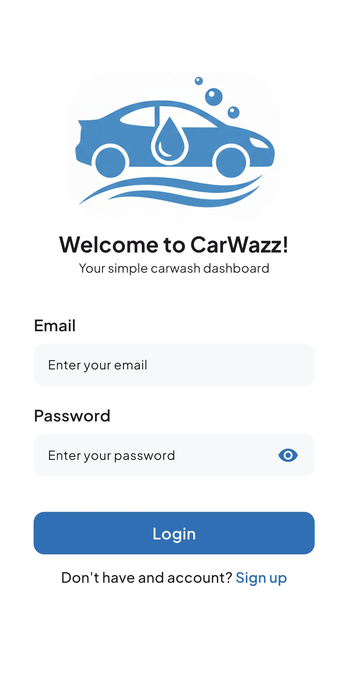
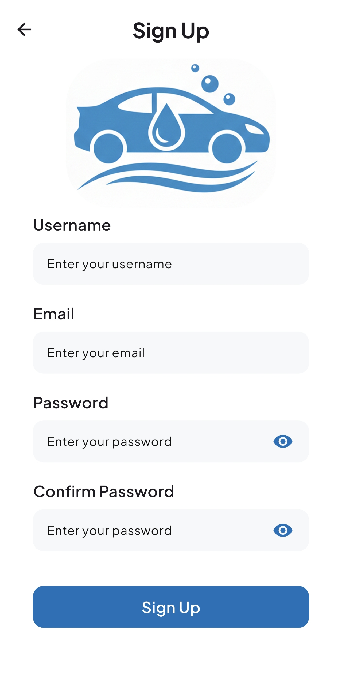
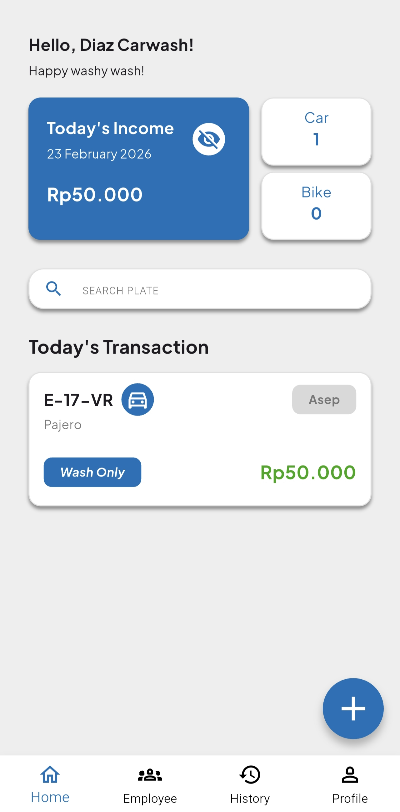
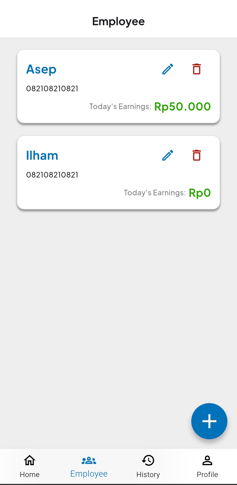
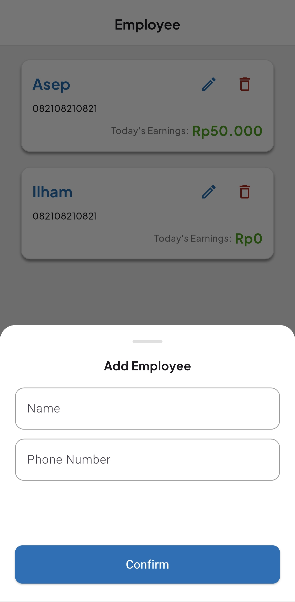
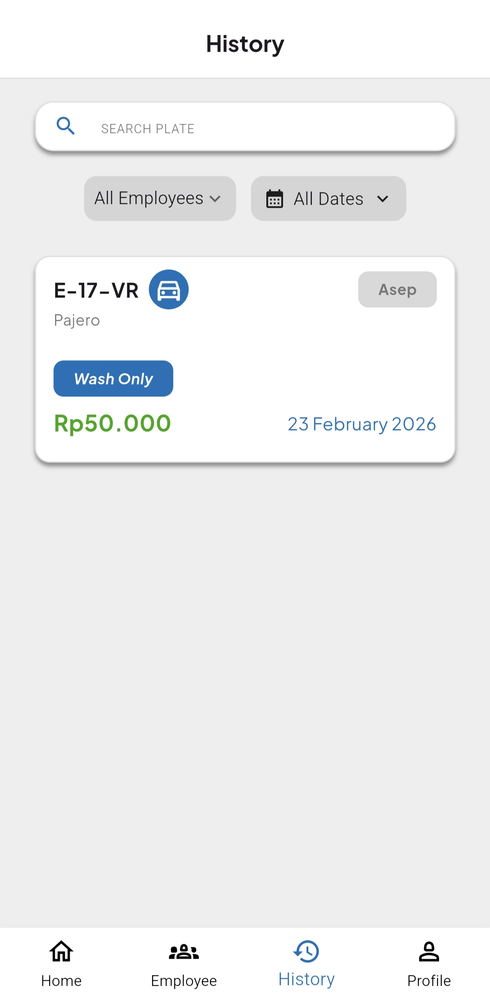
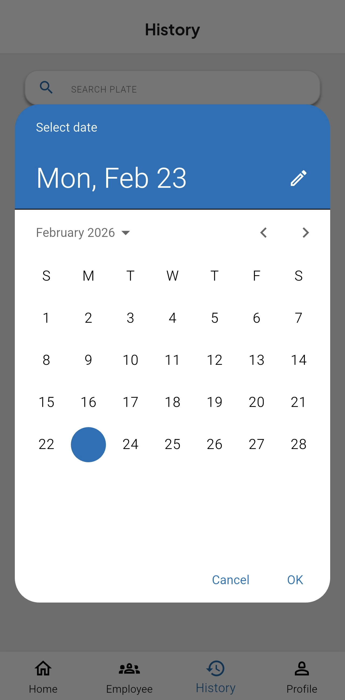
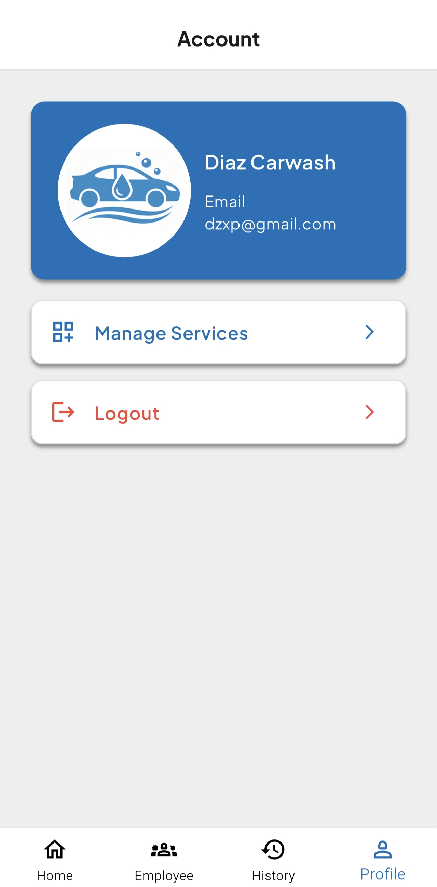
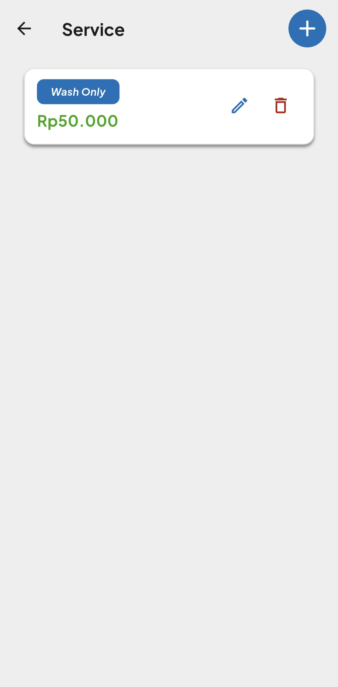
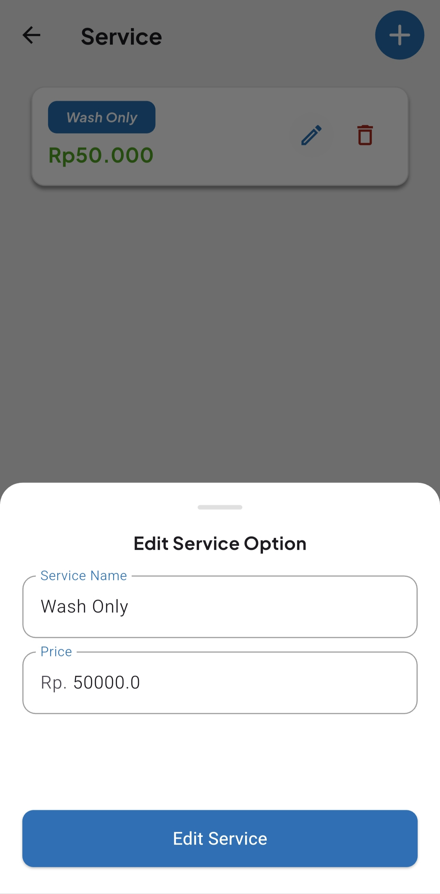

# CarWazz  
Carwash Management Dashboard App

## Deskripsi 
**CarWazz** adalah aplikasi dashboard manajemen carwash yang dirancang untuk membantu pemilik usaha dalam melacak pendapatan, transaksi harian, serta pencatatan pendapatan per karyawan secara real-time.

Aplikasi ini mempermudah monitoring performa bisnis dengan fitur pencatatan jumlah kendaraan, pengelolaan layanan, serta tracking pendapatan masing-masing karyawan setiap hari.

---

## Fitur 

### Transaction Management
- Track pemasukan harian
- Tambah transaksi
- Hapus Transaksi
- Total kendaraan yang dilayani hari ini
- List transaksi harian
- Mencari transaksi hari ini berdasarkan plat nomor

### Employee Management
- Tambah karyawan
- Edit data karyawan
- Hapus karyawan
- Melihat pendapatan masing-masing karyawan hari ini

### History
- Melihat seluruh riwayat transaksi
- Filter berdasarkan:
  - Tanggal
  - Karyawan
- Pencarian berdasarkan plat nomor

### Service Management
- Tambah layanan
- Edit layanan
- Hapus layanan
- Mengatur daftar service yang tersedia


---

## Tech Stack 
- Flutter
- Firebase Authentication
- Cloud Firestore
- GetX

---

## Screenshot 

### Login & Register

<p align="center">
  
  
</p>

### Homepage

<p align="center">
  
  
</p>

### Employee

<p align="center">
  
  
  
</p>

### Transaction

<p align="center">
  
  
</p>

### Profile

<p align="center">
  
</p>

### Service

<p align="center">
  
  
  
</p>

---

## Cara Menjalankan

### 1️⃣ Clone Repository
```bash
git clone https://github.com/Mobile-Innovation-Laboratory-10-0/Flutter-DerilDiaz-CarWazz.git
```

### 2️⃣ Install Dependencies
```bash
flutter pub get
```

### 3️⃣ Jalankan Aplikasi
```bash
flutter run
```

> Aplikasi sudah terhubung dengan Firebase dan siap digunakan tanpa konfigurasi tambahan.

---

## APK Release
https://drive.google.com/file/d/165b51lS0t0GZIIKBgz-XB4r3Qyr6XZwz/view?usp=sharing

---


